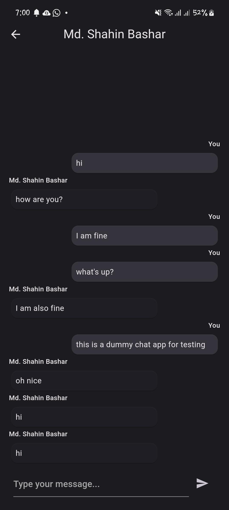
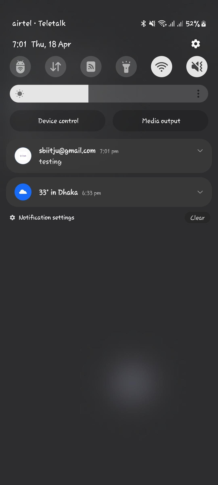

# quick_chat
A simple chat application built using Flutter and Firebase. This app demonstrates user authentication (anonymous sign-in) and real-time messaging using Firebase Firestore. It uses Riverpod for state management, flutter_hooks for widget state, and go_router for navigation.

### Sample

Login Screen | Home Screen
-------------|-----------------
 | 

Conversation Screen | Notification Screen
-------------|-----------------
 | 

## Video Demo

https://www.example.com/quick-chat-demo

## Download Link

https://drive.google.com/drive/folders/1uFVcVjgmbWZBT5dl_SCRckKBa79-L6n7?usp=sharing

## Features

- **User Authentication**
    - Anonymous sign-in for quick access.
    - Google sign-in for authenticated access.

- **Real-time Messaging**
    - Chat with other users in real-time using Firebase Firestore.
    - View ongoing conversations and send messages seamlessly.

- **Notification System**
    - Receive notifications for new messages.
    - Stay updated with push notifications.

- **Conversation Management**
    - Interactive conversation screen with chat history.
    - See who sent the message with timestamps.

- **Routing and Navigation**
    - Smooth navigation using go_router for a seamless user experience.

